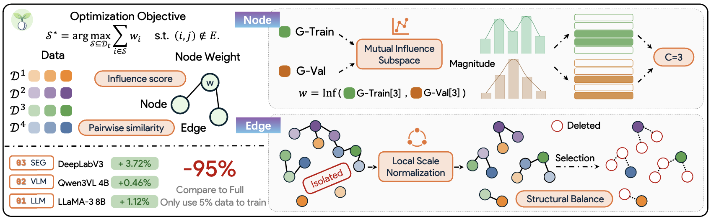

<div align="center">

<h1>
  
  SEED: Targeted Data Selection by Weighted Independent Set
</h1>

<h5 align="center"> 

[Yuan Zhang](https://gumpest.github.io/)<sup>1,2</sup>,
[Lifeng Guo]()<sup>2</sup>,
[Junwen Pan](https://scholar.google.com/citations?user=YvgX3sUAAAAJ&hl=en&oi=sra)<sup>2</sup>,
[Wenzhao Zheng](https://wzzheng.net/)<sup>3</sup>,

[Chang Liu]()<sup>2</sup>,
[Kuan Cheng](https://cfcs.pku.edu.cn/people/faculty/kuancheng/index.htm)<sup>1</sup>,
[Kurt Keutzer](http://people.eecs.berkeley.edu/~keutzer/)<sup>3</sup>,
[Shanghang Zhang](https://idm.pku.edu.cn/info/1017/1598.htm)<sup>1✉️</sup>

<sup>1</sup>School of Computer Science, Peking University, <sup>2</sup>ByteDance Inc, <sup>3</sup>EECS, UC Berkeley

[](https://arxiv.org/pdf/2410.04417)
[](https://github.com/Gumpest/SEED)

</h5>
</div>

## 📜 News

🔥 **[2026/05/18]** We released **[SEED](https://arxiv.org/abs/2605.15691)** and its **[Code](https://github.com/Gumpest/SEED)** is now open-source!

## 👀 Overview

**Overview of SEED**. SEED formulates subset selection as a **Weighted Independent Set**
problem over a similarity graph constructed from training data, with better node weights from a
**mutual influence subspace** and better edges from **local scale normalization**. The resulting structurally
balanced graph enables selecting a compact, diverse, and high-influence subset. Different colors
indicate that nodes belong to different domains, while the color intensity represents the node weights.

<div align=center>

</div>

## 👨‍💻 Preparation

1. Clone this repository and navigate to SEED folder
```bash
git clone https://github.com/Gumpest/SEED.git
cd SEED
```

2. Install necessary package
```Shell
conda create -n seed python=3.10 -y
conda activate seed

pip install torch==2.1.2 torchvision torchaudio
pip install -r requirement.txt
```

3. Install SEED
```Shell
pip install -e .
```

4. Prepare Training and Target Data

    4.1 Instruction Tuning

    - Training datasets: Flan v2, COT, Dolly, and Open Assistant. 

    - Target datasets: MMLU, Tydiqa, and BBH. 

    - A processed version of these files are available in [Google Drive](https://drive.google.com/drive/folders/1lL69197n3pLD4925fnTA619RM9Kx8Ak2?usp=sharing).

    4.2 Visual Instruction Tuning

    - Training datasets: Honeybee-Remake-SEED-200K. 

    - Target datasets: random 5% of benchmark datasets. 

## 🎯 Quick Start

We provide a complete example pipeline (LLaMA3-8B) for the instruction tuning task, covering data selection, model training, and evaluation. All commands are organized as shell scripts for easy reproduction and one-command execution. Please remember to replace the default paths with your own local paths before running the scripts.

### Data Selection with SEED

1. Warmup training (5% random data)
```Shell
bash shell/1_warmup.sh
```

2. Collect the target gradient datastore
```Shell
bash shell/2_gradient_train.sh
```

> Please note that you need to manually switch the comments four times to collect gradients for each of the four datasets separately.

3. Collect the target gradient datastore
```Shell
bash shell/3_gradient_val.sh
```

4. Select data with SEED
```Shell
bash shell/4_select.sh
```

### Training

5. Train the model with selected data
```Shell
bash shell/5_train.sh
```

### Evaluation

6. Evaluate the model
```Shell
bash evaluation/batch_eval.sh
```

7. Print your results
```Shell
python evaluation/print_res.py
```

## License
This project is released under the [Apache 2.0 license](LICENSE).

## Citation

If you use SEED in your research, please cite our work by using the following BibTeX entry:
```bibtex
@article{zhang2026seed,
  title={SEED: Targeted Data Selection by Weighted Independent Set},
  author={Zhang, Yuan and Guo, Lifeng and Pan, Junwen and Liu, Chang and Zheng, Wenzhao and Cheng, Kuan and Keutzer, Kurt and Zhang, Shanghang},
  journal={arXiv preprint arXiv:2605.15691},
  year={2026}
}
```

## Acknowledgment

We extend our gratitude to the open-source efforts of [LESS](https://github.com/princeton-nlp/LESS), [FAISS](https://github.com/facebookresearch/faiss), [HoneyBee](https://huggingface.co/datasets/facebook/HoneyBee).
